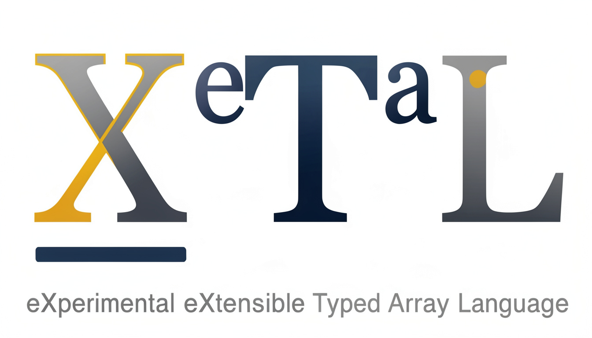
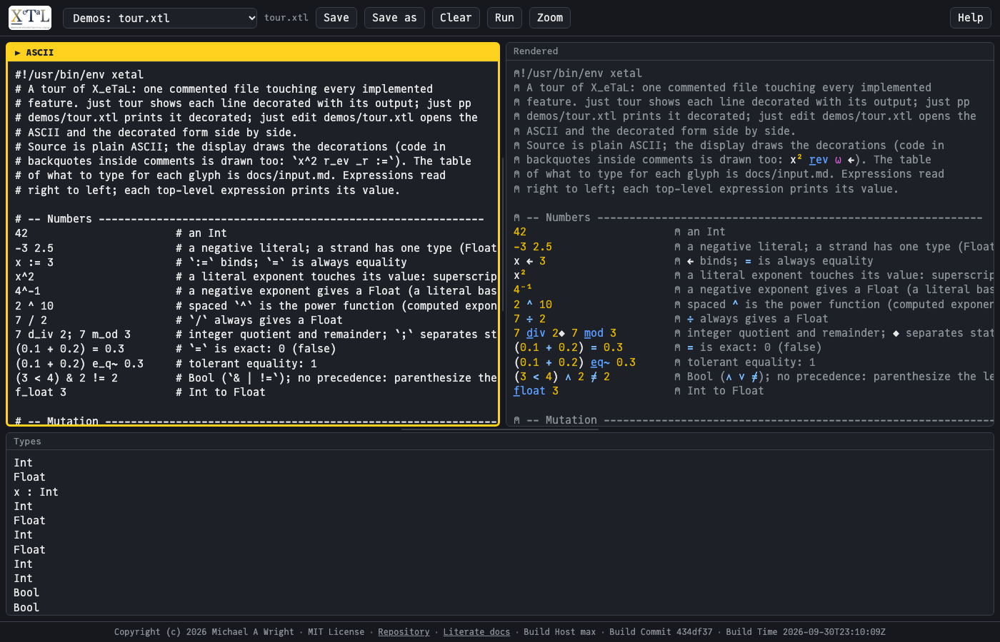
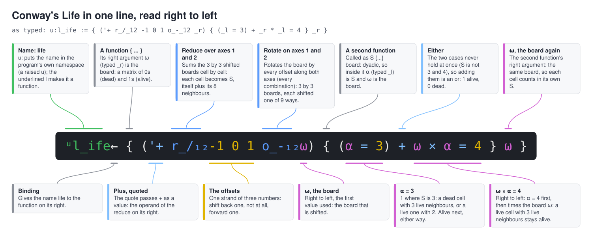
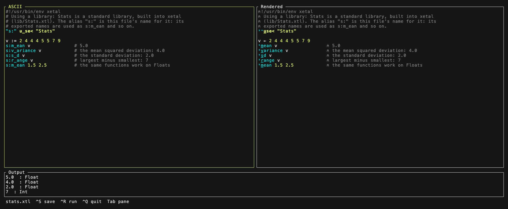
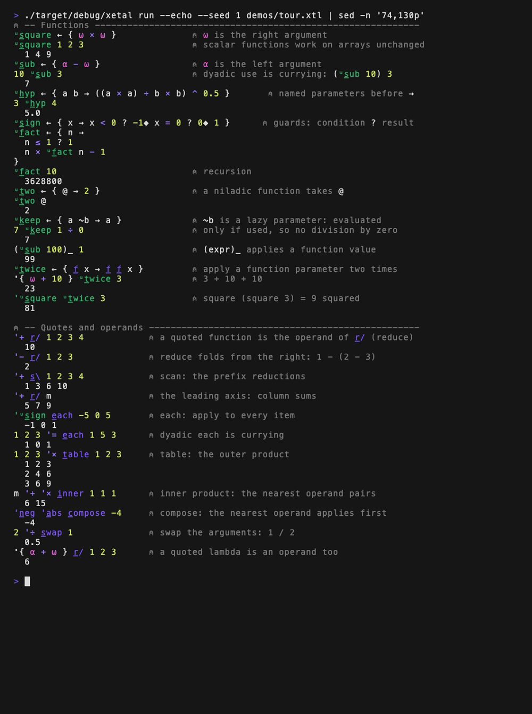

<p align="center">
  
</p>

<p align="center">
  <b><a href="https://softwarewrighter.github.io/X_eTaL/">Try it live in your browser</a></b>
  -- the editor, running in WebAssembly: type ASCII, see it decorated, run it
</p>

# X_eTaL

XeTaL is an experimental, statically typed array language that asks:
what would APL look like if it were designed today for composition,
readability, tooling, and machine learning?

Rather than inventing another collection of syntax, XeTaL explores a
specific design space: APL-style whole-array programming, functional
composition, and shape-aware operations, expressed with ASCII source
that can be rendered typographically without changing the underlying
program.

The goal isn't to replace existing languages. It's to make the powerful
ideas of array programming easier to read, reason about, type-check,
visualize, and experiment with.

In the live demo, type ASCII on the left and watch it drawn decorated
on the right; Run shows the output, the drop-down opens the demos, the
libraries and your saved files, and Save keeps them in the browser.

[](https://softwarewrighter.github.io/X_eTaL/)

**eXperimental eXtensible Typed Array Language** -- LaTeX reversed,
with the X itself decorated.

> LaTeX uses text to produce typography. X_eTaL uses typography to
> express computation.

X_eTaL is a terse, statically typed, functional array language in the
APL / APL2 / J / BQN tradition, implemented in Rust. It uses no
special glyph alphabet: source is plain ASCII typed on a US keyboard,
and **typographic decoration** changes what an ordinary name means.
An underlined letter makes a name a function, a leading superscript
names its namespace, a subscript gives its axes, and a superscript on
a value is an exponent. The language decisions are recorded in
[`docs/lang-choices.md`](docs/lang-choices.md).


| Raw ASCII     | Displayed as                          | Meaning                              |
| ------------- | ------------------------------------- | ------------------------------------ |
| `x`           | x                                     | the variable `x`                     |
| `r_ev`        | rev, r underlined                     | the built-in function reverse        |
| `o_-_2`       | o-, o underlined, subscript 2         | rotate along axis 2                  |
| `'+ r_/ A`    | quote +, then r/ with r underlined    | reduce A by plus (APL `+/A`)         |
| `u:s_quare`   | superscript u, square, s underlined   | a user-defined function              |
| `c:K_`        | superscript c, K underlined           | K from the combinator library        |
| `x^2`         | x squared                             | exponent on a value                  |
| `x^0.5`       | x, raised 0.5 (a middle dot as point) | a decimal exponent: the square root  |
| `_l` `_r`     | APL alpha and omega                   | left / right lambda argument         |
| `:=` `;`      | a left arrow, a black diamond         | binding, statement separator         |
| `@`           | @                                     | the Unit value                       |

Built-in names are words (`r_eshape`, `t_ally`) so code stays
recognizable; a punctuation mark appears only where it carries APL
meaning (`r_/` reduce, `s_\` scan, `o_-` rotate).

At a glance, versus classic APL:

| Category            | APL                          | X_eTaL                                  |
| ------------------- | ---------------------------- | -------------------------------------- |
| Character set       | APL glyphs                   | ASCII source; Unicode/LaTeX for display |
| Function vs value   | fixed glyph identity         | an underlined letter in the name       |
| Axis specification  | separate glyphs / brackets   | subscript digits, e.g. `o_-_2`         |
| Operators           | `/` `\` `.` etc.             | ordinary curried functions: `'+ r_/ A` |
| Typing              | dynamic                      | static, inferred (Hindley-Milner)      |
| Ambiguous syntax    | resolved by fixed rules      | rejected with an explanation           |
| Core model          | niladic/monadic/dyadic       | curried one-argument functions         |
| Implementation      | C / assembly                 | Rust (CLI + WASM playground)           |

The acceptance test is Conway's Life in one line
(`spec/integration/life-blinker.case`, checked against the sw-apl
APL\360 reference); `just life` runs `demos/life.xtl`, which steps a
blinker and a glider with it:

```
u:l_ife := { ('+ r_/_12 -1 0 1 o_-_12 _r) { (_l = 3) + _r * _l = 4 } _r }
```

That is the line as typed. Here it is drawn decorated, as `just pp`
shows it, with each part explained (generated by `xetal diagram` from
[`docs/diagrams/life.notes`](docs/diagrams/life.notes); every callout is
anchored to the tokens it points at):



Read right to left: rotate the board by every offset in `-1 0 1` along
axes 1 and 2, giving a 3 by 3 arrangement of boards, and sum over those
two axes, giving S, each cell plus its neighbours. The inner function
gets S as its left argument and the board as its right, and computes
`(S = 3) + board * (S = 4)`: a cell lives next when S is 3, or when it
is alive and S is 4.


## The name

Say it **Ecks-e-tal**, as the file type `.xtl` is said eks-tee-ell.
Spell it with the logo (an underlined X, a raised e, T, a raised a, L)
where it can be drawn, `X_eTaL` in plain ASCII, XeTaL in a sentence,
and `xetal` for the binary and the code. [`docs/name.md`](docs/name.md)
lists every spelling and why the logo is itself XeTaL (`X_ e:T a:L`).

## Seeing it

Source is typed as ASCII and shown decorated. `xetal edit FILE` puts
the two side by side, with the types (or the first error) below as
you type and the results on Ctrl-R. Tab moves between the panes (the
current one has a thick border) and Ctrl-T zooms it to the full
screen and back:



`just tour` runs the commented language tour, `demos/tour.xtl`, as a
notebook: each statement decorated, followed by its output. A part of
it (the full output is on the [tours page](docs/tour.md)):



`just slow-show FILE` does the same with a pause after each statement,
for watching; here is the whole tour as it scrolls by (also as a
smaller, sharper [WebM video](videos/tour.webm)):


## Status

Early, and specified by its test suite as it is built. Working: the
whole pipeline (lexer, parser, formatter, Core, Hindley-Milner type
inference, a strict evaluator), dense 1-origin arrays with strings,
scalar extension and the structural built-ins, the higher-order
built-ins (reduce, scan, each, table, inner product, compose, swap,
power), search, order and random built-ins, rotate, reverse and axis
subscripts on any function, function power (`f_^3`), the Life
one-liner, files, the keyboard and numbers as text (`[]N_GET`,
`[]N_PUT`, `[]R_EAD`, `f_ormat`, `n_umbers`), and libraries imported
with `u_se<`: the standard libraries `Stats`, `Combinators`
(Smullyan's birds), `Maybe` and `TTTML` (a machine that learns
tic-tac-toe) are built in. The decorated views: `xetal render
--color`, streaming notebook runs laid out as an APL session, the
editor, a REPL that draws each line decorated as you type, and
annotated diagrams. Next: a live web demo of the editor, then ports of
the APL workspaces as libraries (LEARN, COURSE and PLOT first), then
trains and a stepping debugger ([`docs/plan.md`](docs/plan.md)).

## Prerequisites

- [Rust](https://rustup.rs) (stable, via rustup) and
  [`just`](https://github.com/casey/just) (`brew install just` or
  `cargo install just`): enough to build, run and edit programs.
- For the live demo in the browser: the WebAssembly target and
  [trunk](https://trunkrs.dev):
  `rustup target add wasm32-unknown-unknown`, then `brew install trunk`
  or `cargo install trunk`.
- For the full pre-commit gate (maintainers): `reg-rs` (the CLI
  goldens), `sw-checklist` and `sw-markdown-checker`; Emacs for the
  literate documents; vhs, ffmpeg and ImageMagick to regenerate the
  screenshots and the video; Google Chrome for the live demo's
  screenshot.

## Quick Start

With [`just`](https://github.com/casey/just) installed (`just` alone
lists the tasks):

```bash
just tour                                       # the language tour, each line with its output
just eval "'+ r_/_2 2 3 r_eshape r_ange 6"      # row sums: 6 15
just life                                       # Life: a blinker and a glider
just repl                                       # drawn decorated as you type; Up/Down history; Ctrl-D ends
just show demos/stats.xtl                       # a program using the built-in Stats library, as a notebook
just show demos/combinators.xtl                 # Smullyan's birds from the built-in Combinators library
just show demos/monads.xtl                      # the Maybe monad: safe division chained by bind
just tttml                                      # TTTML: learns tic-tac-toe by playing itself (optimized build)
just tttml-train                                # TTTML: train, then save the model in work/tttml.model
just tttml-play                                 # TTTML: play the saved model; you are X, type squares 1 to 9
just pp demos/factorial.xtl                     # print a file decorated and highlighted
just edit demos/life.xtl                        # ASCII left, decorated right
just serve                                      # the live demo locally, at http://127.0.0.1:8095/
just pages                                      # build the live demo into pages/ (published by a workflow)
```

`just run` and `just eval` pass flags through to `xetal`
(`just run --echo FILE`). Without `just`, build with
`scripts/build-all.sh --release` and call `./target/release/xetal`;
the [M0 and M1 tour](docs/tour-m0-m1.md) walks through every stage
(`lex`, `render`, `parse`, `fmt`, `core`, `type`, `eval`).

## Fonts

Use **JuliaMono**, a free monospace font that has every character the
decorated display uses (the combining underline, small raised letters
for namespaces, raised digits for powers and exponents, APL's lamp,
alpha and omega, arrows, the diamond and the math signs), with all
raised digits at one height. It comes from the Julia language
community but is an ordinary font; Julia is not needed.

To install it on macOS, with [Homebrew](https://brew.sh):

```bash
brew install --cask font-juliamono
```

or without Homebrew: download `JuliaMono-ttf.zip` from the
[JuliaMono releases](https://github.com/cormullion/juliamono/releases),
unzip it, double-click `JuliaMono-Regular.ttf` and click Install in
Font Book. Then quit and restart the terminal (iTerm reads its font
list at launch) and choose JuliaMono (iTerm: Settings, Profiles,
Text, Font). To keep another font for plain text, iTerm's "Use a
different font for non-ASCII text" in the same tab can take just the
decorated characters from JuliaMono.

Other fonts, checked against the font files:

| Font | Characters it has | Notes |
| ---- | ----------------- | ----- |
| JuliaMono (free) | all | recommended |
| DejaVu Sans Mono (free) | all | `brew install --cask font-dejavu` |
| Andale Mono, PT Mono (macOS) | about a third | work on macOS, which borrows the rest from other fonts; the raised 1, 2 and 3 are the font's own and the other raised digits are borrowed, so a raised 10 shows its 1 and 0 at different heights |
| Menlo (macOS) | all but the lamp | a system font that iTerm does not offer on current macOS |
| JetBrains Mono, BQN386 | most | no small raised letters or combining underline of their own |
| Monaco (macOS) | all but six | avoid: its arrow, alpha, omega, lamp, raised c and quad come out broken |

## Documentation

- [`docs/tour.md`](docs/tour.md) -- the language tour and the milestone
  tours (M0 to M6)
- [The literate documents as web pages](https://softwarewrighter.github.io/X_eTaL/literate/)
  -- the Org documents below exported to HTML, with an index
- [`docs/literate/tour.org`](docs/literate/tour.org) -- the language tour
  as a literate Org document, every block run and its result recorded
  (`docs/emacs/`: `xetal-mode` and `ob-xetal` for Org Babel)
- [`docs/literate/hello.org`](docs/literate/hello.org) -- a library of
  your own: write `demos/Hello.xtl`, import it, call it
- [`docs/literate/life.org`](docs/literate/life.org) -- Conway's Life,
  the one line built up a piece at a time
- [`docs/literate/libraries.org`](docs/literate/libraries.org) -- what a
  library is, and the standard libraries (Stats, Maybe, Combinators,
  TTTML) at work
- [`docs/literate/birds.org`](docs/literate/birds.org) -- the Combinators
  library run as you read: Smullyan's birds, with diagrams of the key
  definitions
- [`docs/literate/tttml.org`](docs/literate/tttml.org) -- TTTML, a machine
  that learns tic-tac-toe by playing itself, as a literate program over the
  `TTTML` library
- [`docs/reference.md`](docs/reference.md) -- every built-in function, with
  examples (and, for the ones that work along an axis, the default axis,
  axis 1 written out, and another axis)
- [`docs/idioms.md`](docs/idioms.md) -- everyday idioms in X_eTaL beside Java,
  JavaScript, Python, C++ and Rust, and beside APL2, Dyalog APL, J and BQN
- [`docs/permission-response.md`](docs/permission-response.md) -- XeTaL's
  answers to ngn's [Array Language Implementation Permission
  Request](https://ngn.codeberg.page/funny/reg.html)
- [`docs/name.md`](docs/name.md) -- how to say XeTaL (Ecks-e-tal) and
  every way it is spelled
- [`docs/why-another-language.md`](docs/why-another-language.md) --
  XeTaL fills in the [Programming Language
  Checklist](https://www.mcmillen.dev/language_checklist.html)
- [`docs/xetal-apl-skeptics-response.md`](docs/xetal-apl-skeptics-response.md)
  -- XeTaL plays the APL Wiki's complaint-bingo card
  ([Humour](https://aplwiki.com/wiki/Humour))
- [`docs/input.md`](docs/input.md) -- how to type X_eTaL expressions
- [`docs/birds.md`](docs/birds.md) -- the aviary: Smullyan's combinators,
  which type-check, and how the `Combinators` library spells them
- [`docs/lang-choices.md`](docs/lang-choices.md) -- the language decisions
- [`docs/PRD.md`](docs/PRD.md) -- product requirements and milestones
- [`docs/design.md`](docs/design.md) -- language design and decisions register
- [`docs/architecture.md`](docs/architecture.md) -- components, pipeline, testing
- [`docs/plan.md`](docs/plan.md) -- implementation plan and retrospectives
- `docs/research.txt`, `docs/research2.txt` -- archival design research

## Install

```bash
just install                                   # or: just install /some/dir/on/PATH
```

which builds the optimized binary and copies it, with the `x_etal`
link, into `~/.local/bin`. Without `just`:

```bash
scripts/build-all.sh --release
cp target/release/xetal ~/.local/bin/          # any directory on PATH
ln -sf xetal ~/.local/bin/x_etal               # the alias x_etal
```

An installed copy does not update itself: run `just install` again
after pulling changes. The `just` recipes run the optimized build
(`target/release/xetal`), which they rebuild when a source changed
(saying "building xetal...").

With `xetal` on the PATH, `.xtl` scripts run directly:
`./demos/factorial.xtl`.

## Architecture

Component workspaces (`components/<name>/`, each a few small crates)
sharing one `target/` directory:

`base -> lex -> syntax -> core -> types -> eval -> cli / web`

with `render` (raw / decorated / canonical / expanded printers),
`array` (dense arrays and primitive kernels), `hof` (higher-order
built-ins, applying operands through the evaluator), `search`
(search and order built-ins), `axes` (rotate, reverse, axis
subscripts), `system` (files, the keyboard, numbers as text), `view`
(the view model every display draws from: styled,
span-mapped segments, and values laid out as grids), `tui` (the
editor) and `line` (the REPL's line editor) alongside. See
[`docs/architecture.md`](docs/architecture.md).

## Development

Development is test-driven and tracked with
agentrail sagas; see
[`CLAUDE.md`](CLAUDE.md) (also `AGENTS.md`) for the agent workflow and
rules.

```bash
just build                                          # build every component
just test                                           # every component's tests
(cd components/syntax && cargo test)                # test one component
just reg                                            # reg-rs CLI golden tests
just gate                                           # full pre-commit gate
```

Each recipe calls a script in `scripts/` (`build-all.sh`, `gate.sh`,
`reg.sh`, `check-locks.sh`), which work without `just` too. The gate
also runs `scripts/just-smoke.sh`, which runs every recipe (the file
recipes on every demo) and fails on a recipe it has no test for.

## Related Projects

- [sw-mlpl](https://github.com/sw-ml-study/sw-mlpl) -- Software
  Wrighter's Machine Learning Programming Language, a Rust array
  language inspired by APL, APL2, J, and BQN.
- [sw-apl](https://github.com/sw-vibe-coding/sw-apl) -- a clean-room
  APL interpreter in Rust modelled on APL\360 and IBM 5100 APL, for
  the terminal, a local service and the browser.
- [web-sw-cor24-apl](https://github.com/sw-embed/web-sw-cor24-apl) --
  browser-based APL environment running the sw-cor24-apl interpreter
  on an emulated COR24 CPU via WebAssembly.

## Links

- Blog: [Software Wrighter Lab](https://software-wrighter-lab.github.io/)
- Discord: [Join the community](https://discord.com/invite/Ctzk5uHggZ)
- YouTube: [Software Wrighter](https://www.youtube.com/@SoftwareWrighter)

## Copyright

Copyright (c) 2026 Michael A Wright

## License

MIT. See [`LICENSE`](LICENSE) and [`COPYRIGHT`](COPYRIGHT).
