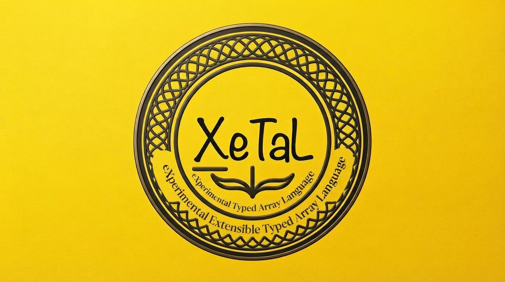
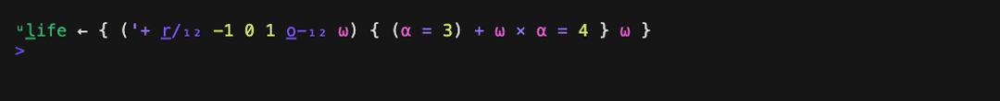

#  X_eTaL

**eXperimental eXtensible Typed Array Language** -- LaTeX reversed,
with the X itself decorated.

> LaTeX uses text to produce typography. X_eTaL uses typography to
> express computation.

X_eTaL is a terse, statically typed, functional array language in the
APL / APL2 / J / BQN tradition, implemented in Rust. It uses no
special glyph alphabet: source is plain ASCII typed on a US keyboard,
and **typographic decoration** changes what an ordinary name means.
An underlined letter makes a name a function, a leading superscript
names its namespace, a subscript gives its axes, and a superscript on
a value is an exponent. The language decisions are recorded in
[`docs/lang-choices.md`](docs/lang-choices.md).

<br clear="left">

| Raw ASCII     | Displayed as                          | Meaning                              |
| ------------- | ------------------------------------- | ------------------------------------ |
| `x`           | x                                     | the variable `x`                     |
| `r_ev`        | rev, r underlined                     | the built-in function reverse        |
| `o_-_2`       | o-, o underlined, subscript 2         | rotate along axis 2                  |
| `'+ r_/ A`    | quote +, then r/ with r underlined    | reduce A by plus (APL `+/A`)         |
| `u:s_quare`   | superscript u, square, s underlined   | a user-defined function              |
| `c:K_`        | superscript c, K underlined           | K from the combinator library        |
| `x^2`         | x squared                             | exponent on a value                  |
| `_l` `_r`     | APL alpha and omega                   | left / right lambda argument         |
| `:=` `;`      | a left arrow, a black diamond         | binding, statement separator         |
| `@`           | @                                     | the Unit value                       |

Built-in names are words (`r_eshape`, `t_ally`) so code stays
recognizable; a punctuation mark appears only where it carries APL
meaning (`r_/` reduce, `s_\` scan, `o_-` rotate).

At a glance, versus classic APL:

| Category            | APL                          | X_eTaL                                  |
| ------------------- | ---------------------------- | -------------------------------------- |
| Character set       | APL glyphs                   | ASCII source; Unicode/LaTeX for display |
| Function vs value   | fixed glyph identity         | an underlined letter in the name       |
| Axis specification  | separate glyphs / brackets   | subscript digits, e.g. `o_-_2`         |
| Operators           | `/` `\` `.` etc.             | ordinary curried functions: `'+ r_/ A` |
| Typing              | dynamic                      | static, inferred (Hindley-Milner)      |
| Ambiguous syntax    | resolved by fixed rules      | rejected with an explanation           |
| Core model          | niladic/monadic/dyadic       | curried one-argument functions         |
| Implementation      | C / assembly                 | Rust (CLI + WASM playground)           |

The acceptance test is Conway's Life in one line
(`spec/integration/life-blinker.case`, checked against the sw-apl
APL\360 reference); `just life` runs `demos/life.xtl`, which steps a
blinker and a glider with it:

```
u:l_ife := { ('+ r_/_12 -1 0 1 o_-_12 _r) { (_l = 3) + _r * _l = 4 } _r }
```

That is the line as typed. Pretty-printed (`just pp`), the same source
is drawn decorated and highlighted:



Read right to left: rotate the board `_r` by every offset in `-1 0 1`
along axes 1 and 2 (`o_-_12`), giving a 3 by 3 arrangement of boards,
and sum over those two axes (`'+ r_/_12`), giving S, each cell plus
its neighbours. The inner lambda gets S as `_l` and the board as `_r`
and computes `(S = 3) + board * (S = 4)`: a cell lives next when S is
3, or when it is alive and S is 4.

## Seeing it

Source is typed as ASCII and shown decorated. `xetal edit FILE` puts
the two side by side, with the types (or the first error) below as
you type and the results on Ctrl-R:


`just tour` runs the commented language tour, `demos/tour.xtl`, as a
notebook: each statement decorated, followed by its output. A part of
it (the full output is on the [tours page](docs/tour.md)):


`just slow-show FILE` does the same with a pause after each statement,
for watching; here is the whole tour as it scrolls by (also as a
smaller, sharper [WebM video](videos/tour.webm)):


## Status

Early, and specified by its test suite as it is built. Working: the
whole pipeline (lexer, parser, formatter, Core, Hindley-Milner type
inference, a strict evaluator), dense 1-origin arrays with strings,
scalar extension and the structural built-ins, the higher-order
built-ins (reduce, scan, each, table, inner product, compose, swap),
search, order and random built-ins, rotate, reverse and axis
subscripts on any function, the Life one-liner, libraries imported
with `u_se<` (a standard library, `Stats`, is built in), and the
decorated views: `xetal render --color`, notebook runs, the editor and
a REPL that draws each line decorated as you type. Next: the
combinators as a library, function power, trains, the stepping
debugger and a web playground ([`docs/plan.md`](docs/plan.md)).

## Quick Start

With [`just`](https://github.com/casey/just) installed (`just` alone
lists the tasks):

```bash
just tour                                       # the language tour, each line with its output
just eval "'+ r_/_2 2 3 r_eshape r_ange 6"      # row sums: 6 15
just life                                       # Life: a blinker and a glider
just repl                                       # drawn decorated as you type; Up/Down history; Ctrl-D ends
just show demos/stats.xtl                       # a program using the built-in Stats library, as a notebook
just pp demos/factorial.xtl                     # print a file decorated and highlighted
just edit demos/life.xtl                        # ASCII left, decorated right
```

`just run` and `just eval` pass flags through to `xetal`
(`just run --echo FILE`). Without `just`, build with
`scripts/build-all.sh --release` and call `./target/release/xetal`;
the [M0 and M1 tour](docs/tour-m0-m1.md) walks through every stage
(`lex`, `render`, `parse`, `fmt`, `core`, `type`, `eval`).

## Documentation

- [`docs/tour.md`](docs/tour.md) -- the language tour and the milestone
  tours (M0 to M6b)
- [`docs/literate/tour.org`](docs/literate/tour.org) -- the language tour
  as a literate Org document, every block run and its result recorded
  (`docs/emacs/`: `xetal-mode` and `ob-xetal` for Org Babel)
- [`docs/input.md`](docs/input.md) -- how to type X_eTaL expressions
- [`docs/birds.md`](docs/birds.md) -- the aviary: Smullyan's combinators,
  which type-check, and how the `Combinators` library spells them
- [`docs/lang-choices.md`](docs/lang-choices.md) -- the language decisions
- [`docs/PRD.md`](docs/PRD.md) -- product requirements and milestones
- [`docs/design.md`](docs/design.md) -- language design and decisions register
- [`docs/architecture.md`](docs/architecture.md) -- components, pipeline, testing
- [`docs/plan.md`](docs/plan.md) -- implementation plan and retrospectives
- `docs/research.txt`, `docs/research2.txt` -- archival design research

## Install

```bash
just install                                   # or: just install /some/dir/on/PATH
```

which builds the optimized binary and copies it, with the `x_etal`
link, into `~/.local/bin`. Without `just`:

```bash
scripts/build-all.sh --release
cp target/release/xetal ~/.local/bin/          # any directory on PATH
ln -sf xetal ~/.local/bin/x_etal               # the alias x_etal
```

An installed copy (and `target/release/xetal`) does not update itself:
run `just install` again after pulling changes. The `just` recipes
use the debug build, which they rebuild as needed.

With `xetal` on the PATH, `.xtl` scripts run directly:
`./demos/factorial.xtl`.

## Architecture

Component workspaces (`components/<name>/`, each a few small crates)
sharing one `target/` directory:

`base -> lex -> syntax -> core -> types -> eval -> cli / web`

with `render` (raw / decorated / canonical / expanded printers),
`array` (dense arrays and primitive kernels), `hof` (higher-order
built-ins, applying operands through the evaluator), `search`
(search and order built-ins), `axes` (rotate, reverse, axis
subscripts), `view` (the view model every display draws from: styled,
span-mapped segments, and values laid out as grids), `tui` (the
editor) and `line` (the REPL's line editor) alongside. See
[`docs/architecture.md`](docs/architecture.md).

## Development

Development is test-driven and tracked with
agentrail sagas; see
[`CLAUDE.md`](CLAUDE.md) (also `AGENTS.md`) for the agent workflow and
rules.

```bash
just build                                          # build every component
just test                                           # every component's tests
(cd components/syntax && cargo test)                # test one component
just reg                                            # reg-rs CLI golden tests
just gate                                           # full pre-commit gate
```

Each recipe calls a script in `scripts/` (`build-all.sh`, `gate.sh`,
`reg.sh`, `check-locks.sh`), which work without `just` too. The gate
also runs `scripts/just-smoke.sh`, which runs every recipe (the file
recipes on every demo) and fails on a recipe it has no test for.

## Related Projects

- [sw-mlpl](https://github.com/sw-ml-study/sw-mlpl) -- Software
  Wrighter's Machine Learning Programming Language, a Rust array
  language inspired by APL, APL2, J, and BQN.
- [sw-apl](https://github.com/sw-vibe-coding/sw-apl) -- a clean-room
  APL interpreter in Rust modelled on APL\360 and IBM 5100 APL, for
  the terminal, a local service and the browser.
- [web-sw-cor24-apl](https://github.com/sw-embed/web-sw-cor24-apl) --
  browser-based APL environment running the sw-cor24-apl interpreter
  on an emulated COR24 CPU via WebAssembly.

## Links

- Blog: [Software Wrighter Lab](https://software-wrighter-lab.github.io/)
- Discord: [Join the community](https://discord.com/invite/Ctzk5uHggZ)
- YouTube: [Software Wrighter](https://www.youtube.com/@SoftwareWrighter)

## Copyright

Copyright (c) 2026 Michael A Wright

## License

MIT. See [`LICENSE`](LICENSE) and [`COPYRIGHT`](COPYRIGHT).
