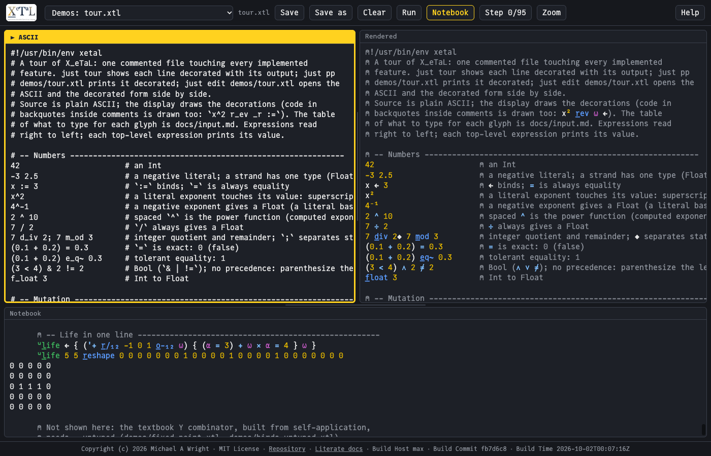

# Notebooks: a program shown a statement at a time

A notebook shows a program the way an APL session does: each statement
drawn decorated and indented six spaces, and what it printed directly
under it, flush left. It is the same program and the same results as
an ordinary run; only the layout differs. XeTaL has it in three places:
the live demo (the Notebook and Step buttons), the command line (`just
show`), and the literate documents.



## Why

An ordinary run prints only results. For a single answer that is
enough, but for a program that builds something up (the tour, Life, a
classic like Pascal's triangle) the results alone lose the thread:
which line printed `3628800`? which made that board? A notebook puts
each result under the statement that produced it, so you can read a
program and its behavior together, top to bottom.

Stepping goes one further: it runs a program one statement at a time,
so you can watch it build up, and stop to look at any point. It is the
first step towards the stepping debugger planned in Saga 17 (which
will step inside a line, not only from line to line).

## In the live demo

The [live demo](https://softwarewrighter.github.io/X_eTaL/)'s toolbar
has three ways to run the program in the editor:

- **Run** shows only the output, as `xetal run` does (the output pane
  titled "Output"). While a program runs it becomes Stop.
- **Notebook** runs the whole program as a notebook: the output pane,
  titled "Notebook", shows each statement drawn and indented, with what
  it printed (and any pictures it drew) under it.
- **Step k/n**, where n is the number of statements, runs the program
  up to its next statement and shows the notebook so far, the statement
  just run marked with a yellow bar on its left; the title reads
  "Notebook (step k)". At the end (n of n) it turns off.
- **Reset**, shown while stepping, goes back to the types, and Step
  starts again from the first statement. Clear, Run and Notebook also
  reset the steps.

The **Boxed** switch (yellow when on) changes how results print in all
three: every array framed, as APL2's DISPLAY draws it.

A statement is a top-level statement of the program: a multi-line
definition (a function written over several lines in braces) is one
statement, and the comments just above a statement are shown with it.

Try it: open `factorial.xtl` and click Run (just `3628800`), then
Notebook (the program with `3628800` under its last line); then Step
twice (the definition, then the call and its result), and Reset. Or
open `tour.xtl` and click Notebook to read the whole tour with its
results.

## On the command line

`just show FILE` (that is, `xetal run --echo FILE`) prints a program as
a notebook, decorated and colored, streaming: each statement is shown
just before it runs and its output appears under it as it is printed,
so a long computation shows its progress. `just slow-show FILE MS`
waits between statements, for watching.

For example, `demos/factorial.xtl` is, as typed:

```
#!/usr/bin/env xetal
# M1: recursion with guards, one statement per line.
u:f_act := { n ->
  n <= 1 ? 1
  n * u:f_act n - 1
}
u:f_act 10
```

and `just show demos/factorial.xtl` prints, in order: the two comments,
then the definition over its four lines, then `u:f_act 10`, each line
indented six spaces and drawn (the comments with a lamp, `u:` as a
raised u, `:=` as an arrow, `<=` and `*` as their symbols); then the
result, `3628800`, flush left under the statement that printed it.

The golden `reg/notebook-factorial` pins this output exactly.

## In the literate documents

The [literate documents](https://softwarewrighter.github.io/X_eTaL/literate/)
(`docs/literate/*.org`) are notebooks written by hand: prose, then a
block of XeTaL drawn decorated, then its result recorded under it, each
block run by `xetal` through Org Babel (`ob-xetal`) in Emacs, and the
recorded results checked by the gate.

## How it works

The evaluator calls a hook just before each top-level statement runs.
The command line's notebook and the live demo's both use it: the hook
hands over the statement's source (with the comments above it), which
is drawn, and the output that follows is grouped under it. In the live
demo the program runs in a worker, which posts each statement's source
and each line of output as they happen, so the notebook fills in while
the program runs. Step k runs the program cut off after its k-th
statement, from the start each time, as an interactive session replays
what came before; a program that draws pictures shows them under the
statement that drew them. (docs/design.md, sections 8.3 and 8.3a.)
