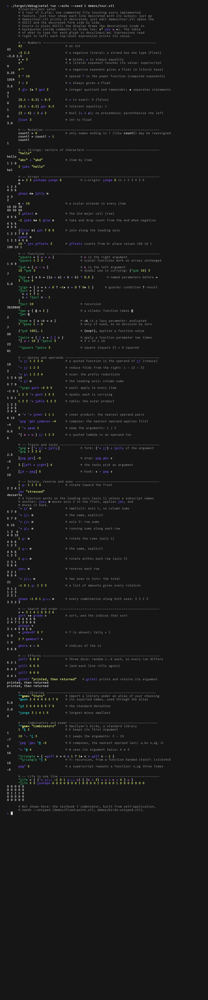

# Tours

Two ways to see the language:

- The **language tour**, `demos/tour.xtl`: one commented file touching
  every feature. `just tour` (or `xetal run --echo demos/tour.xtl`)
  shows each statement decorated, followed by its output; the image
  below is that output (the dice use `--seed 1`).
- The **milestone tours**, one page per milestone, each built around
  commands whose output is pinned by the test suite:
  - [M0 and M1](tour-m0-m1.md): the pipeline stage by stage (lex,
    render, parse, fmt, core), scalars, lambdas, guards, recursion
  - [M2](tour-m2.md): types and Unit
  - [M3](tour-m3.md): arrays, strings, the REPL
  - [M4](tour-m4.md): higher-order built-ins, search, order, random
  - [M5](tour-m5.md): rotate, reverse and axis subscripts
  - [M5b](tour-m5b.md): the decorated views (pretty-printing, notebook
    runs, the editor, the live REPL)
  - [M6b](tour-m6b.md): libraries (`u_se<`, exports and private names,
    the standard library Stats)
  - [M6](tour-m6.md): the Combinators library, function power, the Maybe
    monad, TTTML, files and the keyboard, the streaming notebook

The images are regenerated by `scripts/screenshots.sh` (vhs and
ImageMagick) from the tapes in `images/tapes/`; the recording of the
tour scrolling by ([animated](../videos/tour.webp),
[video](../videos/tour.webm)) by `scripts/videos.sh` from
`videos/tapes/`.

